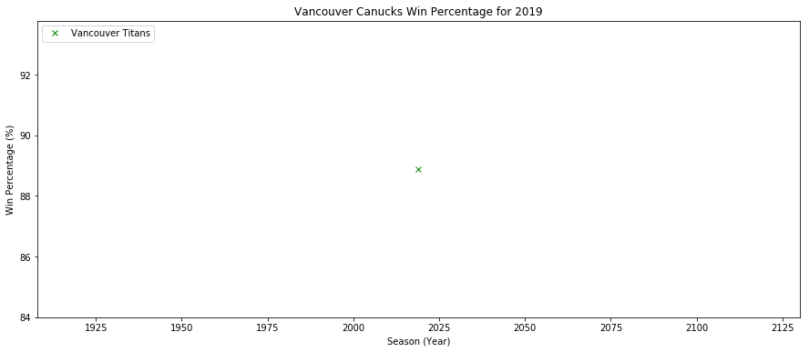

## Question: Which Vancouver sports team should you cheer for? 🏒

Bandwagoning is an art! To embrace bandwagoning, we should turn our attention to teams with the best win percentage. In Vancouver, there are six professional sports teams that battle at the highest level amongst their respective leagues. These leagues range from football to soccer to baseball and even to gaming. The question is: **Which professional sports team in Vancouver has the best win percentage over time?**


Professional Sports Teams in Vancouver:
* BC Lions (American Football)
* Vancouver Canadians (Baseball)
* Vancouver Canucks (Ice Hockey)
* Vancouver Titans (Overwatch/Gaming)
* Vancouver Warriors (Lacrosse)
* Vancouver Whitecaps (Soccer)


```python
# invite the party people!
import pandas as pd
import requests
import numpy as np
from bs4 import BeautifulSoup

# invite the artists
import matplotlib.pyplot as plt
```


```python
# write a helper function to assist in transforming wiki tables into dataframes
def get_df(url,pos):
    res = requests.get(url)
    soup = BeautifulSoup(res.content,'lxml')
    table = soup.find_all('table')[pos] 
    df = pd.read_html(str(table))[0]
    return df
```


```python
# Let's start with the BC Lions
df_lions = get_df('https://en.wikipedia.org/wiki/List_of_BC_Lions_seasons',1)
# lets clean this up a bit and extract only the relevant information
df_lions = df_lions.iloc[0:64]
# filter out for the columns we want (win/loss)
df_lions_col = ['Leagueseason', 'Wins', 'Losses']
df_lions = df_lions[df_lions_col]
# calculate the win percentage for ever year as an additional column
df_lions['Win Percentage'] = (df_lions['Wins'] / (df_lions['Wins'] + df_lions['Losses']))*100
# rename Leagueseason to season
df_lions.rename(columns={"Leagueseason": "Season"},inplace=True)
# convert entire dataframe to numbers
df_lions = df_lions.apply(pd.to_numeric)
#df_lions.info()
df_lions.head()
```


<table border="1" class="dataframe">
  <thead>
    <tr style="text-align: right;">
      <th></th>
      <th>Season</th>
      <th>Wins</th>
      <th>Losses</th>
      <th>Win Percentage</th>
    </tr>
  </thead>
  <tbody>
    <tr>
      <th>0</th>
      <td>1954</td>
      <td>1</td>
      <td>15</td>
      <td>6.250000</td>
    </tr>
    <tr>
      <th>1</th>
      <td>1955</td>
      <td>5</td>
      <td>11</td>
      <td>31.250000</td>
    </tr>
    <tr>
      <th>2</th>
      <td>1956</td>
      <td>6</td>
      <td>10</td>
      <td>37.500000</td>
    </tr>
    <tr>
      <th>3</th>
      <td>1957</td>
      <td>4</td>
      <td>11</td>
      <td>26.666667</td>
    </tr>
    <tr>
      <th>4</th>
      <td>1958</td>
      <td>3</td>
      <td>13</td>
      <td>18.750000</td>
    </tr>
  </tbody>
</table>
</div>


```python
df_lions.describe()
```


<div>
<table border="1" class="dataframe">
  <thead>
    <tr style="text-align: right;">
      <th></th>
      <th>Season</th>
      <th>Wins</th>
      <th>Losses</th>
      <th>Win Percentage</th>
    </tr>
  </thead>
  <tbody>
    <tr>
      <th>count</th>
      <td>64.000000</td>
      <td>64.000000</td>
      <td>64.000000</td>
      <td>64.000000</td>
    </tr>
    <tr>
      <th>mean</th>
      <td>1985.500000</td>
      <td>8.281250</td>
      <td>8.343750</td>
      <td>49.427146</td>
    </tr>
    <tr>
      <th>std</th>
      <td>18.618987</td>
      <td>3.234088</td>
      <td>2.885204</td>
      <td>18.435072</td>
    </tr>
    <tr>
      <th>min</th>
      <td>1954.000000</td>
      <td>1.000000</td>
      <td>2.000000</td>
      <td>6.250000</td>
    </tr>
    <tr>
      <th>25%</th>
      <td>1969.750000</td>
      <td>6.000000</td>
      <td>6.000000</td>
      <td>37.053571</td>
    </tr>
    <tr>
      <th>50%</th>
      <td>1985.500000</td>
      <td>8.000000</td>
      <td>8.500000</td>
      <td>50.000000</td>
    </tr>
    <tr>
      <th>75%</th>
      <td>2001.250000</td>
      <td>11.000000</td>
      <td>10.250000</td>
      <td>62.500000</td>
    </tr>
    <tr>
      <th>max</th>
      <td>2017.000000</td>
      <td>14.000000</td>
      <td>15.000000</td>
      <td>84.615385</td>
    </tr>
  </tbody>
</table>
</div>


The BC Lions have an average win percentage of 49.42%.<br>
The BC Lions' lowest win percentage was 6.25% in 1954 (their first year).<br>
The BC Lions' highest win percentage was 84.61% in 1964.<br>


```python
plt.figure(figsize=(15,6))
plt.plot(df_lions['Season'],df_lions['Win Percentage'], color='orange', label='BC Lions', linewidth=2)
plt.legend(loc=2)
plt.title('BC Lions Win Percentage from 1954 to 2019')
plt.xlabel('Season (Year)')
plt.ylabel('Win Percentage (%)')
```


```python
# Vancouver Canadians is the only table that does not exist in Wikipedia. Table scraping should be similar though.
df_canadians = get_df('https://www.baseball-reference.com/bullpen/Vancouver_Canadians',0)
# Filter for relevant columns and drop 2019 with no data
df_canadians = df_canadians[['Year', 'Record']][:-1]
# Split the Record column into Wins and Losses
df_canadians[['Wins','Losses']] = df_canadians['Record'].str.split('-',expand=True) 
# Drop the Record column
df_canadians.drop(['Record'],inplace=True,axis=1)
# Convert everything to a number
df_canadians["Wins"] = df_canadians["Wins"].astype(int)
df_canadians["Losses"] = df_canadians["Losses"].astype(int)
# Calculate the win percentage
df_canadians['Win Percentage'] = ( df_canadians['Wins'] / (df_canadians['Wins'] + df_canadians['Losses']) )*100
# Rename Year to Season
df_canadians.rename(columns={"Year": "Season"},inplace=True)
#df_canadians.info()
df_canadians.head()
```


<div>

<table border="1" class="dataframe">
  <thead>
    <tr style="text-align: right;">
      <th></th>
      <th>Season</th>
      <th>Wins</th>
      <th>Losses</th>
      <th>Win Percentage</th>
    </tr>
  </thead>
  <tbody>
    <tr>
      <th>0</th>
      <td>1978</td>
      <td>74</td>
      <td>65</td>
      <td>53.237410</td>
    </tr>
    <tr>
      <th>1</th>
      <td>1979</td>
      <td>79</td>
      <td>68</td>
      <td>53.741497</td>
    </tr>
    <tr>
      <th>2</th>
      <td>1980</td>
      <td>79</td>
      <td>60</td>
      <td>56.834532</td>
    </tr>
    <tr>
      <th>3</th>
      <td>1981</td>
      <td>56</td>
      <td>76</td>
      <td>42.424242</td>
    </tr>
    <tr>
      <th>4</th>
      <td>1982</td>
      <td>72</td>
      <td>72</td>
      <td>50.000000</td>
    </tr>
  </tbody>
</table>
</div>


```python
df_canadians.describe()
```


<div>

<table border="1" class="dataframe">
  <thead>
    <tr style="text-align: right;">
      <th></th>
      <th>Season</th>
      <th>Wins</th>
      <th>Losses</th>
      <th>Win Percentage</th>
    </tr>
  </thead>
  <tbody>
    <tr>
      <th>count</th>
      <td>41.000000</td>
      <td>41.000000</td>
      <td>41.000000</td>
      <td>41.000000</td>
    </tr>
    <tr>
      <th>mean</th>
      <td>1998.000000</td>
      <td>56.829268</td>
      <td>53.682927</td>
      <td>51.307211</td>
    </tr>
    <tr>
      <th>std</th>
      <td>11.979149</td>
      <td>18.995924</td>
      <td>17.341336</td>
      <td>6.221258</td>
    </tr>
    <tr>
      <th>min</th>
      <td>1978.000000</td>
      <td>29.000000</td>
      <td>30.000000</td>
      <td>36.296296</td>
    </tr>
    <tr>
      <th>25%</th>
      <td>1988.000000</td>
      <td>39.000000</td>
      <td>37.000000</td>
      <td>48.684211</td>
    </tr>
    <tr>
      <th>50%</th>
      <td>1998.000000</td>
      <td>53.000000</td>
      <td>57.000000</td>
      <td>51.315789</td>
    </tr>
    <tr>
      <th>75%</th>
      <td>2008.000000</td>
      <td>74.000000</td>
      <td>68.000000</td>
      <td>55.263158</td>
    </tr>
    <tr>
      <th>max</th>
      <td>2018.000000</td>
      <td>85.000000</td>
      <td>90.000000</td>
      <td>61.594203</td>
    </tr>
  </tbody>
</table>
</div>


The Vancouver Canadians have an average win percentage of 51.30%.<br>
The Vancouver Canadians' lowest win percentage was 36.30% in 1991.<br>
The Vancouver Canadians' highest win percentage was 61.59% in 1986.<br>


```python
plt.figure(figsize=(15,6))
plt.plot(df_canadians['Season'],df_canadians['Win Percentage'], color='red', label='Vancouver Canadians', linewidth=2)
plt.legend(loc=2)
plt.title('Vancouver Canadians Win Percentage from 1978 to 2019')
plt.xlabel('Season (Year)')
plt.ylabel('Win Percentage (%)')
```


```python
# Do the same for the Canucks
df_canucks = get_df('https://en.wikipedia.org/wiki/List_of_Vancouver_Canucks_seasons',2)
# Clean up and filter the multi-index
df_canucks.columns = [' '.join(set(col)).strip() for col in df_canucks.columns.values]
df_canucks = df_canucks[['NHL season','W Regular-season', 'L Regular-season','W Postseason', 'L Postseason']]
# remove the year of the NHL Lockout
df_canucks.drop(df.index[34],inplace=True)
# convert undefined values in Postseason to 0
df_canucks['W Postseason'].replace('—', 0,inplace=True)
df_canucks['L Postseason'].replace('—', 0,inplace=True)
# remove non-digit values in Regular season
df_canucks['W Regular-season'] = df_canucks['W Regular-season'].str.extract('(\d+)', expand=False)
df_canucks['L Regular-season'] = df_canucks['L Regular-season'].str.extract('(\d+)', expand=False)
df_canucks['NHL season'] = df_canucks['NHL season'].str.extract('(\d+)', expand=False)
# convert entire dataframe to numbers
df_canucks = df_canucks.apply(pd.to_numeric)
# combine regular season and post seasons wins and losses
df_canucks['Wins'] = df_canucks['W Regular-season'] + df_canucks['W Postseason']
df_canucks['Losses'] = df_canucks['L Regular-season'] + df_canucks['L Postseason']
# calculate the win percentage for ever year as an additional column
df_canucks['Win Percentage'] = ( df_canucks['Wins'] / (df_canucks['Wins'] + df_canucks['Losses']) )*100
# rename NHL season to season
df_canucks.rename(columns={"NHL season": "Season"},inplace=True)
# only keep relevant columns
df_canucks = df_canucks[['Season','Wins','Losses','Win Percentage']]
#df_canucks.info()
df_canucks.head()
```


<div>

<table border="1" class="dataframe">
  <thead>
    <tr style="text-align: right;">
      <th></th>
      <th>Season</th>
      <th>Wins</th>
      <th>Losses</th>
      <th>Win Percentage</th>
    </tr>
  </thead>
  <tbody>
    <tr>
      <th>0</th>
      <td>1970</td>
      <td>24</td>
      <td>46</td>
      <td>34.285714</td>
    </tr>
    <tr>
      <th>1</th>
      <td>1971</td>
      <td>20</td>
      <td>50</td>
      <td>28.571429</td>
    </tr>
    <tr>
      <th>2</th>
      <td>1972</td>
      <td>22</td>
      <td>47</td>
      <td>31.884058</td>
    </tr>
    <tr>
      <th>3</th>
      <td>1973</td>
      <td>24</td>
      <td>43</td>
      <td>35.820896</td>
    </tr>
    <tr>
      <th>4</th>
      <td>1974</td>
      <td>39</td>
      <td>36</td>
      <td>52.000000</td>
    </tr>
  </tbody>
</table>
</div>


```python
df_canucks.describe()
```


<div>

<table border="1" class="dataframe">
  <thead>
    <tr style="text-align: right;">
      <th></th>
      <th>Season</th>
      <th>Wins</th>
      <th>Losses</th>
      <th>Win Percentage</th>
    </tr>
  </thead>
  <tbody>
    <tr>
      <th>count</th>
      <td>48.000000</td>
      <td>48.000000</td>
      <td>48.000000</td>
      <td>48.000000</td>
    </tr>
    <tr>
      <th>mean</th>
      <td>1993.791667</td>
      <td>35.229167</td>
      <td>37.875000</td>
      <td>47.486635</td>
    </tr>
    <tr>
      <th>std</th>
      <td>14.364493</td>
      <td>11.706044</td>
      <td>7.033733</td>
      <td>10.775762</td>
    </tr>
    <tr>
      <th>min</th>
      <td>1970.000000</td>
      <td>20.000000</td>
      <td>19.000000</td>
      <td>28.571429</td>
    </tr>
    <tr>
      <th>25%</th>
      <td>1981.750000</td>
      <td>25.000000</td>
      <td>33.000000</td>
      <td>37.737449</td>
    </tr>
    <tr>
      <th>50%</th>
      <td>1993.500000</td>
      <td>32.000000</td>
      <td>38.500000</td>
      <td>46.621005</td>
    </tr>
    <tr>
      <th>75%</th>
      <td>2006.250000</td>
      <td>42.500000</td>
      <td>43.000000</td>
      <td>56.496881</td>
    </tr>
    <tr>
      <th>max</th>
      <td>2018.000000</td>
      <td>69.000000</td>
      <td>50.000000</td>
      <td>70.408163</td>
    </tr>
  </tbody>
</table>
</div>


The Vancouver Canucks have an average win percentage of 47.49%.<br>
The Vancouver Canucks' lowest win percentage was 28.57% in 1971.<br>
The Vancouver Canucks' highest win percentage was 70.41% in 2010.<br>


```python
# plot win percentages over the years for the Vancouver Canucks
plt.figure(figsize=(15,6))
plt.plot(df_canucks['Season'],df_canucks['Win Percentage'], color='blue', label='Vancouver Canucks', linewidth=2)
plt.legend(loc=2)
plt.title('Vancouver Canucks Win Percentage from 1970 to 2019')
plt.xlabel('Season (Year)')
plt.ylabel('Win Percentage (%)')
```


    


```python
# Lets create the dataframe for the Vancouver Titans
df_titans = get_df('https://en.wikipedia.org/wiki/2019_Vancouver_Titans_season',3)
# The Vancouver titans have only been playing for a single year, hence their table is spread across the games that occured in 2019
# First, let's extract out the 'Overall' row for the relevant data of the single year of play in 2019
df_titans = df_titans.iloc[5]
# Let's add a season column
df_titans['Season'] = 2019
# only keeping the relevant columns
df_titans = df_titans[['Season','W','L']]
# convert all columns to correct types
df_titans['Season'] = int(df_titans['Season'])
df_titans['W'] = int(df_titans['W'])
df_titans['L'] = int(df_titans['L'])
# Calculate the win percentage
df_titans['Win Percentage'] = ( df_titans['W'] / (df_titans['W'] + df_titans['L']) )*100
# Rename to correct column names
df_titans.rename({'W':'Wins','L':'Losses'},inplace=True)
df_titans.head()
```


    Season               2019
    Wins                   24
    Losses                  3
    Win Percentage    88.8889
    Name: 5, dtype: object


```python
df_titans.describe()
```


    count      4.000000
    unique     4.000000
    top       88.888889
    freq       1.000000
    Name: 5, dtype: float64


```python
df_canucks[df_canucks['Win Percentage'] == df_canucks['Win Percentage'].min()]
```

Note: The Vancouver Titans have only had one season of professional play.<br>
The Vancouver Titans have an average win percentage of 88.89%.<br>
The Vancouver Titans' lowest win percentage was 88.89% in 2019.<br>
The Vancouver Titans' highest win percentage was 88.89% in 2019.<br>


```python
plt.figure(figsize=(15,6))
plt.plot(df_titans['Season'],df_titans['Win Percentage'], 'gx', label='Vancouver Titans', linewidth=2)
plt.legend(loc=2)
plt.title('Vancouver Canucks Win Percentage for 2019')
plt.xlabel('Season (Year)')
plt.ylabel('Win Percentage (%)')
```


    





```python
# Vancouver Warriors dataframe, let's go!
df_warriors = get_df('https://en.wikipedia.org/wiki/Vancouver_Warriors',2)
# This dataframe is interesting because its Win-Loss is in one column, we will need to parse this
# Let's get the relevant columns and remove the "Total" rows
df_warriors = df_warriors[['Season','W–L']][:5]
# Split the W-L column into Wins and Losses
df_warriors[['Wins','Losses']] = df_warriors['W–L'].str.split('–',expand=True) 
# Drop the W-L column
df_warriors.drop(['W–L'],inplace=True,axis=1)
# Convert everything to a number
df_warriors = df_warriors.apply(pd.to_numeric)
# Calculate the win percentage
df_warriors['Win Percentage'] = ( df_warriors['Wins'] / (df_warriors['Wins'] + df_warriors['Losses']) )*100
df_warriors.head()
```


<div>

<table border="1" class="dataframe">
  <thead>
    <tr style="text-align: right;">
      <th></th>
      <th>Season</th>
      <th>Wins</th>
      <th>Losses</th>
      <th>Win Percentage</th>
    </tr>
  </thead>
  <tbody>
    <tr>
      <th>0</th>
      <td>2014</td>
      <td>4</td>
      <td>14</td>
      <td>22.222222</td>
    </tr>
    <tr>
      <th>1</th>
      <td>2015</td>
      <td>5</td>
      <td>13</td>
      <td>27.777778</td>
    </tr>
    <tr>
      <th>2</th>
      <td>2016</td>
      <td>5</td>
      <td>13</td>
      <td>27.777778</td>
    </tr>
    <tr>
      <th>3</th>
      <td>2017</td>
      <td>9</td>
      <td>9</td>
      <td>50.000000</td>
    </tr>
    <tr>
      <th>4</th>
      <td>2018</td>
      <td>2</td>
      <td>16</td>
      <td>11.111111</td>
    </tr>
  </tbody>
</table>
</div>


```python
df_warriors.describe()
```


<div>

<table border="1" class="dataframe">
  <thead>
    <tr style="text-align: right;">
      <th></th>
      <th>Season</th>
      <th>Wins</th>
      <th>Losses</th>
      <th>Win Percentage</th>
    </tr>
  </thead>
  <tbody>
    <tr>
      <th>count</th>
      <td>5.000000</td>
      <td>5.00000</td>
      <td>5.00000</td>
      <td>5.000000</td>
    </tr>
    <tr>
      <th>mean</th>
      <td>2016.000000</td>
      <td>5.00000</td>
      <td>13.00000</td>
      <td>27.777778</td>
    </tr>
    <tr>
      <th>std</th>
      <td>1.581139</td>
      <td>2.54951</td>
      <td>2.54951</td>
      <td>14.163943</td>
    </tr>
    <tr>
      <th>min</th>
      <td>2014.000000</td>
      <td>2.00000</td>
      <td>9.00000</td>
      <td>11.111111</td>
    </tr>
    <tr>
      <th>25%</th>
      <td>2015.000000</td>
      <td>4.00000</td>
      <td>13.00000</td>
      <td>22.222222</td>
    </tr>
    <tr>
      <th>50%</th>
      <td>2016.000000</td>
      <td>5.00000</td>
      <td>13.00000</td>
      <td>27.777778</td>
    </tr>
    <tr>
      <th>75%</th>
      <td>2017.000000</td>
      <td>5.00000</td>
      <td>14.00000</td>
      <td>27.777778</td>
    </tr>
    <tr>
      <th>max</th>
      <td>2018.000000</td>
      <td>9.00000</td>
      <td>16.00000</td>
      <td>50.000000</td>
    </tr>
  </tbody>
</table>
</div>


The Vancouver Warriors have an average win percentage of 27.78% <br>
The Vancouver Warriors' lowest win percentage was 50.00% in 2017.<br>
The Vancouver Warriors' highest win percentage was 11.11% in 2018.<br>


```python
plt.figure(figsize=(15,6))
plt.plot(df_warriors['Season'],df_warriors['Win Percentage'], color='black', label='Vancouver Warriors', linewidth=2)
plt.legend(loc=2)
plt.title('Vancouver Warriors Win Percentage from 2014 to 2019')
plt.xlabel('Season (Year)')
plt.ylabel('Win Percentage (%)')
```


    


```python
# Okay, let's get the last dataframe. Vancouver Whitecaps FC!
df_whitecaps = get_df('https://en.wikipedia.org/wiki/List_of_Vancouver_Whitecaps_FC_seasons',2)
# Clean up and filter the multi-index
df_whitecaps.columns = [' '.join(set(col)).strip() for col in df_whitecaps.columns.values]
# Since we are strictly looking at win rate, we can take the ratio of wins over number of games played
df_whitecaps = df_whitecaps[['Year','W MLS Regular season','L MLS Regular season', 'MLS Regular season D']]
# Rename to correct column names
df_whitecaps.columns = ['Season', 'Wins', 'Losses', 'Draws']
df_whitecaps['Win Percentage'] = ( df_whitecaps['Wins'] / (df_whitecaps['Wins'] + df_whitecaps['Losses'] + df_whitecaps['Draws']))*100
#df_whitecaps.info()
df_whitecaps.head()
```


<div>

<table border="1" class="dataframe">
  <thead>
    <tr style="text-align: right;">
      <th></th>
      <th>Season</th>
      <th>Wins</th>
      <th>Losses</th>
      <th>Draws</th>
      <th>Win Percentage</th>
    </tr>
  </thead>
  <tbody>
    <tr>
      <th>0</th>
      <td>2011</td>
      <td>6</td>
      <td>18</td>
      <td>10</td>
      <td>17.647059</td>
    </tr>
    <tr>
      <th>1</th>
      <td>2012</td>
      <td>11</td>
      <td>13</td>
      <td>10</td>
      <td>32.352941</td>
    </tr>
    <tr>
      <th>2</th>
      <td>2013</td>
      <td>13</td>
      <td>12</td>
      <td>9</td>
      <td>38.235294</td>
    </tr>
    <tr>
      <th>3</th>
      <td>2014</td>
      <td>12</td>
      <td>8</td>
      <td>14</td>
      <td>35.294118</td>
    </tr>
    <tr>
      <th>4</th>
      <td>2015</td>
      <td>16</td>
      <td>13</td>
      <td>5</td>
      <td>47.058824</td>
    </tr>
  </tbody>
</table>
</div>


```python
df_whitecaps.describe()
```


<div>

<table border="1" class="dataframe">
  <thead>
    <tr style="text-align: right;">
      <th></th>
      <th>Season</th>
      <th>Wins</th>
      <th>Losses</th>
      <th>Draws</th>
      <th>Win Percentage</th>
    </tr>
  </thead>
  <tbody>
    <tr>
      <th>count</th>
      <td>8.00000</td>
      <td>8.000000</td>
      <td>8.000000</td>
      <td>8.000000</td>
      <td>8.000000</td>
    </tr>
    <tr>
      <th>mean</th>
      <td>2014.50000</td>
      <td>12.000000</td>
      <td>13.000000</td>
      <td>9.000000</td>
      <td>35.294118</td>
    </tr>
    <tr>
      <th>std</th>
      <td>2.44949</td>
      <td>3.116775</td>
      <td>2.828427</td>
      <td>2.618615</td>
      <td>9.166985</td>
    </tr>
    <tr>
      <th>min</th>
      <td>2011.00000</td>
      <td>6.000000</td>
      <td>8.000000</td>
      <td>5.000000</td>
      <td>17.647059</td>
    </tr>
    <tr>
      <th>25%</th>
      <td>2012.75000</td>
      <td>10.750000</td>
      <td>12.000000</td>
      <td>7.750000</td>
      <td>31.617647</td>
    </tr>
    <tr>
      <th>50%</th>
      <td>2014.50000</td>
      <td>12.500000</td>
      <td>13.000000</td>
      <td>9.000000</td>
      <td>36.764706</td>
    </tr>
    <tr>
      <th>75%</th>
      <td>2016.25000</td>
      <td>13.500000</td>
      <td>13.500000</td>
      <td>10.000000</td>
      <td>39.705882</td>
    </tr>
    <tr>
      <th>max</th>
      <td>2018.00000</td>
      <td>16.000000</td>
      <td>18.000000</td>
      <td>14.000000</td>
      <td>47.058824</td>
    </tr>
  </tbody>
</table>
</div>


The Vancouver Whitecaps FC have an average win percentage of 35.29% <br>
The Vancouver Whitecaps FC's lowest win percentage was 17.65% in 2011.<br>
The Vancouver Whitecaps FC's highest win percentage was 47.06% in 2015.<br>


```python
plt.figure(figsize=(15,6))
plt.plot(df_whitecaps['Season'],df_whitecaps['Win Percentage'], color='purple', label='Vancouver Whitecaps FC', linewidth=2)
plt.legend(loc=2)
plt.title('Vancouver Whitecpas FC Win Percentage from 2011 to 2019')
plt.xlabel('Season (Year)')
plt.ylabel('Win Percentage (%)')
```


    


We will overlay all the win percentage graphs of each respective team into one figure. This will let us know the win trends between each team. 


```python
# overlay all the win percentage figures of each team
plt.figure(figsize=(15,6))

plt.plot(df_lions['Season'],df_lions['Win Percentage'], color='orange', label='BC Lions', linewidth=2)
plt.plot(df_canadians['Season'],df_canadians['Win Percentage'], color='red', label='Vancouver Canadians',linewidth=2)
plt.plot(df_canucks['Season'],df_canucks['Win Percentage'], color='blue', label='Vancouver Canucks', linewidth=2)

plt.plot(df_whitecaps['Season'],df_whitecaps['Win Percentage'], color='purple', label='Vancouver Whitecaps FC', linewidth=2)
plt.plot(df_warriors['Season'],df_warriors['Win Percentage'], color='black', label='Vancouver Warriors', linewidth=2)
plt.plot(df_titans['Season'],df_titans['Win Percentage'], 'gx', label='Vancouver Titans', linewidth=2)

plt.xticks(np.arange(1950, 2025, 5))
plt.yticks(np.arange(0, 105, 10))
plt.legend(loc=2)

plt.title('Vancouver Sports Teams Win Percentages throughout the years')
plt.xlabel('Season (Year)')
plt.ylabel('Win Percentage (%)')

```


    


After analysing the win percentages throughout the years, the win percentage trend (at least for the older teams like the BC Lions) seems to come in waves. There is no clear indication of any steady growth or decline that hast lasted for the longevity of each team. Based on the graph overlay above I can make a few suggestions on which team to look towards for the highest chance of a victory dance:
* The Vancouver Titans seem to be incredible strong in their respective gaming league. Despite it being their first season, **the Vancouver Titans rank the highest in term of win percentage** amongst all the other professional Vancouver sports teams. If you enjoy gaming (particularly Overwatch), please cheer and watch the Vancouver Titans in the Overwatch League! 🎮
* The team with **the lowest average win percentage is the Vancouver Warriors at 27.78%**. Knowing that this team is young and has not been showing the best results, please refrain from bandwagoning Vancouver's Lacrosse team. 🥍
* The team with the highest average win percentage is the Vancouver Titans. But since they only have played one season, it is not a reliable representation of answer our research question of the highest win percentage "throughout the years". Disregarding the Vancouver Titans, the **next highest win percentage belongs to the Vancouver Canadians at 51.30%**! In terms of popularity, the Vancouver Canadians are in a minor league and has a smaller audience. The BC Lions and Vancouver Canucks are a percentage shy of 50% in terms of win percentage, which is still commendable for a bandwagon investment given their larger following. ⚾
